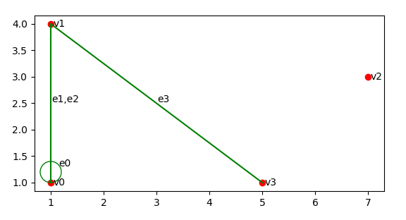
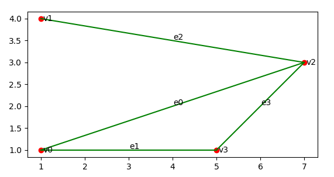
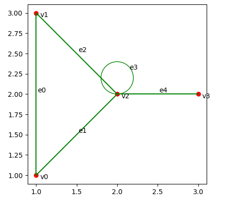
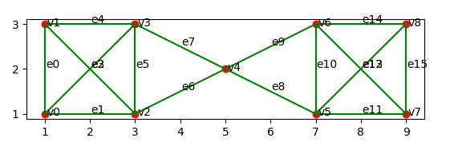

# 图论及其应用

对于任意无向图G(输入为矩阵)，编写程序实现：

- 任务一：画出图G，并给所有顶点和边标号
- 任务二：求出图G的度序列
- 任务三：画出图G的补图
- 任务四：判断图G的连通性
- 任务五：求出图G的边连通度和点连通度
- 任务六：求出图G的最小点割集和最小边割集(元素最少)

## 解决方案

### 任务一（画出图G，并给所有顶点和边标号）

- 通过 `BrushTools` 类中的 `draw_vertex()# 画点, draw_edge()# 画边, show()# 展示绘制图像` 方法实现
- 使用二维矩阵接收点和边，点用坐标表示，边用邻接矩阵表示，如下所示：

```python
import numpy as np

# 接收点
v = np.array([[1, 1], [1, 4], [7, 3], [5, 1]])
# 接收边
e = np.array([[1, 2, 0, 0],
              [2, 0, 0, 1],
              [0, 0, 0, 0],
              [0, 1, 0, 0]])
```

- 使用python绘图库matplotlib实现图的绘制
    - 使用matplotlib中的 `scatter(x坐标, y坐标, c="颜色")` 函数绘制图的顶点
    - 使用matplotlib中的 `plot(x坐标, y坐标, c="颜色")` 函数绘制图的边，其中边的始点和终点坐标通过邻接矩阵`e`找到对应顶点坐标矩阵`v`中相应的坐标
    - 通过matplotlib中的 `add_artist(plt.Circle((圆心坐标), 半径, fill=是否填充, color="颜色"))` 函数为画布上添加圆形来表示环
    - 使用matplotlib中的 `annotate(注释内容, xy=[添加注释的点的坐标], xytext=[注释文字的坐标])` 注释函数为点和边添加注释。注：在非简单无向图中，平行边通过为一条边添加多个不同的边注释来表示
    - 使用matplotlib中的 `show()` 函数将绘制完的图像进行展示

### 任务二（求出图G的度序列）

- 通过 `CalcTools` 类中的 `calc_degrees()` 方法实现度序列的计算
- 因为是无向图，因此点vi的度数只需要考虑邻接矩阵 `e` 中从vi点出发的边的条数，即关注邻接矩阵中的第i行，其中，环提供两度，该方法的主要结构如下：

```python
d_line = []
d = 0
for i in range(0, self.e.shape[0]):
    for j in range(0, self.e.shape[1]):
        if self.e[i][j] > 0:
            if i == j:
                d += 2 * self.e[i][j]
            else:
                d += 1 * self.e[i][j]
    d_line.append(d)
    d = 0
```

- 其中d_line用来保存最终返回的度序列，当i==j时，说明该边为环，当内层循环结束时，将该点的度数和添加到d_line中

### 任务三（画出图G的补图）

- 通过 `BrushTools` 类中的 `draw_complement` 方法实现补图的计算和绘制
- 先将原图预处理为简单图，遍历邻接矩阵 `e` ，将对角线数字置为0（去环），将其他非0位置的值置为1（去平行边）

```python
for i in range(0, e.shape[0]):
    for j in range(0, e.shape[1]):
        # 去环
        if i == j:
            e[i][j] = 0
        else:
            # 去平行边
            if e[i][j] > 0:
                e[i][j] = 1
```

- 将处理后的邻接矩阵 `e` 中的非对角线位置的值进行非操作，即可获得该图补图的邻接矩阵

```python
for i in range(0, ec.shape[0]):
    for j in range(0, ec.shape[1]):
        if i != j:
            if ec[i][j] == 1:
                ec[i][j] = 0
            else:
                ec[i][j] = 1
```

- 调用任务一中实现的绘图方法 `BrushTools.show()` 实现补图的绘制与展示

### 任务四（判断图G的连通性）

- 通过 `CalcTools` 类中的 `judge_connect()` 方法判断图的连通性
- 无向图中若任意两点均可达，则为连通的
- 从图中任意一点vi出发，将该点加入连通点列表 `v_connect` 中，判断能否到达其他不在 `v_connect` 中的点，即邻接矩阵 `e` 的第i行是否有非零数
    - 如果没有，则说明vi与其他点不相邻，说明该图为非连通的
    - 如果有，则说明vi与对应点相邻，进行递归，重复以上过程，继续判断对应点是否能继续走到其他点？
- 完成以上过程后，得到从vi点出发可以到达所有点的列表 `v_connect` ，对其进行处理，判断其中的元素个数是否与该图总顶点数相同，如果相同则说明从vi点出发可以到达所有顶点，该图连通，否则不连通

```python
# 计算图的连通性
def calc_connect(self, flag):
    self.v_connect.append(flag)
    for i in range(0, self.e.shape[1]):
        if i > 0 and i not in self.v_connect:
            if self.e[flag][i] != 0:
                self.calc_connect(i)


# 判断连通性
def judge_connect(self):
    flag = False
    self.calc_connect(0)
    result = list(set(self.v_connect))
    self.v_connect = []
    if len(result) == self.e.shape[0]:
        flag = True
    return flag
```

### 任务五、六

- 任务五：求出图G的边连通度和点连通度
- 任务六：求出图G的最小点割集和最小边割集(元素最少)
- 任务五和任务六相关，找出最小边割集/点割集，即可获取图的边连通度/点连通度
- 该任务的整体思路为，以找出最小边割集为例，在连通图中从少到多删除图中的边，然后调用任务四中实现的判断图连通性的方法 `CalcTools.judge_connect()`
  或其变体`CalcTools.judge_connect_complex()`
  来判断删除边后的图的连通性，一旦图不连通，则找出一个图的最小边割集，该边割集的大小即为该图的边连通度，该方法的思想同样可以找出所有的最小边割集，此处实现只找出其中一个作为展示
    - 判断边连通度
        - 首先判断输入图是否为连通图 `judge_connect()` 非连通图直接返回空列表
        - 第一层循环为删除的边的个数，其范围为1到n-1(n为点的个数)： `for num in range(1, self.e.shape[0])`
            - 使用 `e2del = list(combinations(待组合列表, 组合大小))` 函数来获取本次循环中要删除的边的组合，其中待组合列表为邻接矩阵 `e`
              中所表示的所有边，组合大小为i，即本次循环要删除的边的个数， `e2del`即为本次循环中要删除的边的各种组合
            - 第二层循环，从e2del中取出待删除的边，进行删除，然后判断图的连通性，如果不连通则找到其中一个最小边割集，将其进行返回，否则对邻接矩阵 `e` 进行复原，继续进行循环

```python
for edges in e2del:
    del_count = 0

    cut = []

    temp_e = copy.deepcopy(self.e)
    for i in range(0, temp_e.shape[0]):
        for j in range(i + 1, temp_e.shape[1]):
            while temp_e[i][j] > 0:
                del_count += 1
                temp_e[i][j] -= 1
                temp_e[j][i] -= 1

                for e in edges:
                    # 说明该边在要删除的边组合中
                    if del_count == e:
                        self.e[i][j] = 0
                        self.e[j][i] = 0
                        # 对该边进行保存
                        cut.append((i, j))
    # 删除完边，判断图的连通性
    flag = self.judge_connect()

    # 对边进行还原
    self.e = copy.deepcopy(dc_e)

    if not flag:
        return cut
```

- 计算点割集的整体思想与计算边割集的思想一致，在 `CalcTools.calc_vertex_connect()`
  方法中实现，该方法从少到多找出所有删除点的组合，然后对点和关联边进行删除，同时判断删除点和边之后的图的连通性，此处不再做过多解释

```python
def calc_vertex_connect(self):
    # 深拷贝原邻接矩阵
    dc_e = copy.deepcopy(self.e)

    # 判断是不是连通图
    if not self.judge_connect():
        return []

    # 计算图中的所有点个数
    v_count = self.v.shape[0]
    # 待组合列表
    v_combination = range(0, v_count)

    # 删点和相关联的边，然后判断是否连通
    for num in range(1, self.v.shape[0]):
        # 确定要删除的点组合
        v2del = list(combinations(v_combination, num))

        # 循环删除要删除的点和边组合
        for vertexes in v2del:
            cut = []

            self.e = np.array(self.e)
            for v in vertexes:
                self.e[v, :] = 0
                self.e[:, v] = 0
                cut.append(v)

            # 如果删除的点数等于n-1，直接返回
            if num == self.v.shape[0] - 1:
                return cut

            # 删除完点和关联边，判断图的连通性
            flag = self.judge_connect_complex(self.v.shape[0], vertexes)
            if not flag:
                return cut

            # 对边进行还原
            self.e = copy.deepcopy(dc_e)
    self.e = copy.deepcopy(dc_e)
```

## 测试结果

### 任务一

- 画出图G，并给所有顶点和边标号
- 输入点和边如下所示：

```python
v = np.array([[1, 1], [1, 4], [7, 3], [5, 1]])
e = np.array([[1, 2, 0, 0],
              [2, 0, 0, 1],
              [0, 0, 0, 0],
              [0, 1, 0, 0]])
```

- 绘图结果展示：



### 任务二

- 求出图G的度序列
- 输入点和边与任务一相同，度序列如下，与任务一展示图结果相对应，注：图中e1和e2为平行边

```python
# 任务二：图的度序列为[4, 3, 0, 1]
```

### 任务三

- 画出图G的补图
- 输入点和边与任务一相同，补图如下所示，与任务一的结果相对应



### 任务四

- 判断图G的连通性
- 输入点和边与任务一相同，运行方法判断图的连通性，结果如下所示：

```python
# 任务四：该图的连通性为False
```

- 重新输入新的点坐标和边邻接矩阵，使新的图连通，如下所示

```python
# 接收点
v = np.array([[1, 1], [1, 3], [2, 2], [3, 2]])
# 接收边
e = np.array([[0, 1, 1, 0],
              [1, 0, 1, 0],
              [1, 1, 1, 1],
              [0, 0, 1, 0]])
```

- 重新输入图的展示与连通性判断结果如下：



```python
# 任务四：该图的连通性为True
```

### 任务五、六

- 求出图G的边连通度和点连通度
- 求出图G的最小点割集和最小边割集(元素最少)
- 输入的图如下所示：

```python
# 接收点
v = np.array([[1, 1], [1, 3], [3, 1], [3, 3], [5, 2], [7, 1], [7, 3], [9, 1], [9, 3]])
# 接收边
e = np.array([[0, 1, 1, 1, 0, 0, 0, 0, 0],
              [1, 0, 1, 1, 0, 0, 0, 0, 0],
              [1, 1, 0, 1, 1, 0, 0, 0, 0],
              [1, 1, 1, 0, 1, 0, 0, 0, 0],
              [0, 0, 1, 1, 0, 1, 1, 0, 0],
              [0, 0, 0, 0, 1, 0, 1, 1, 1],
              [0, 0, 0, 0, 1, 1, 0, 1, 1],
              [0, 0, 0, 0, 0, 1, 1, 0, 1],
              [0, 0, 0, 0, 0, 1, 1, 1, 0]
              ])
```



- 边割集/点割集，边连通度/点连通度计算结果如下：

```python
# 任务五、六：边连通度是2,最小边割集是[(2, 4), (3, 4)]
# 任务五、六：点连通度是1,最小点割集是[4]
```

- 其中边割集(2,4)表示从点v2到v4的边，即图中的e6，同理(3,4)表示图中的e7
- 点割集中的4表示图中的v4